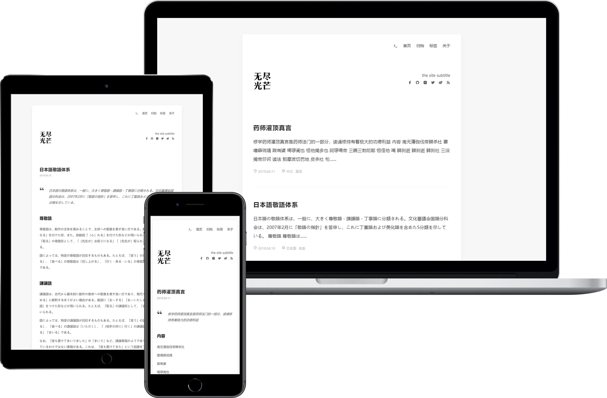

# Hugo Theme Zozo

[](https://github.com/varkai/hugo-theme-zozo/blob/master/LICENSE)

A simple and beautiful theme for Hugo

> It's a port of [Aragaki](https://github.com/PCDotFan/Aragaki), The style is reference from [菩提树下](https://blog.caicai.me/), Some functions are referenced from [Even](https://github.com/olOwOlo/hugo-theme-even)

**Features**

+ **Responsive**
+ **Syntax highlighting with highlightjs**
+ **Math with mathjax** 
+ **Social links(Customize)**
+ **Tags page**
+ **Archive page**
+ **Disqus and [Valine](https://valine.js.org/en/index.html) comment-system**
+ **Fancybox**
+ **GoogleAnalytics**

[Demo](https://zozo.varkai.com) | [中文说明](./README-zh.md)

## Sceenshots



## Installation

```bash
$ git clone https://github.com/varkai/hugo-theme-zozo themes/zozo
```

**Important**: Take a look inside the [`exampleSite`](./exampleSite) folder of this theme. You'll find a file called [`config.toml`](./exampleSite/config.toml). To use it, copy the [`config.toml`](./exampleSite/config.toml) in the root folder of your Hugo site. Feel free to change it.

## ExampleSite

There is an example site with config file and markdown files in `exampleSite` directory.

## About Page

Use the about page to introduce yourself to your visitors. You can customize the content as you like in the `/content/about/index.md`.

## Shortcodes

This theme provides `img` shortcodes.

```markdown

```

## MathJax

This theme supports MathJax, which are turned off by default. If you want to use them, you need to set them in `config.toml`.

Set `mathjax = true` under the `[params]` to support the MathJax.

## Valine Comment System

This theme provides valine comment system, the default is closed, if you want to use, need to set in `config. toml`.

Set the `enable = true` under `[params.valine]` to open valine, and will be `appId` and `appKey` set for yourself.

## Social Link Icons

You can add a social link panel in the header by adding entries to the social block in the `config.toml`.

[Remix icon](https://remixicon.com/) is used in this theme.

## Nearly Finished

In order to see your site in action, run Hugo's built-in local server.

```bash
$ hugo server
```

Now enter `localhost:1313` in the address bar of your browser.

## License

Released under the [MIT](https://github.com/varkai/hugo-theme-zozo/blob/master/LICENSE) License.

## Acknowledgements

- [Aragaki](https://github.com/PCDotFan/Aragaki)
- [菩提树下](https://blog.caicai.me/)
- [olOwOlo](https://olowolo.com/)